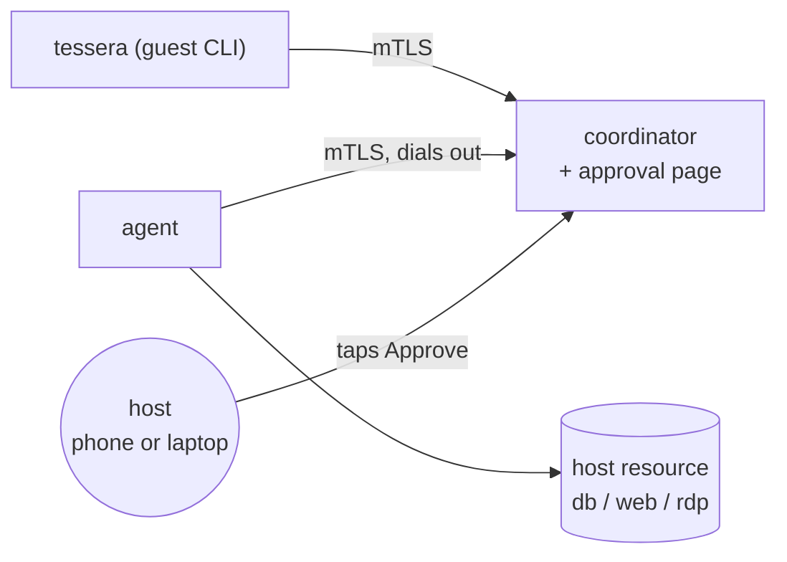
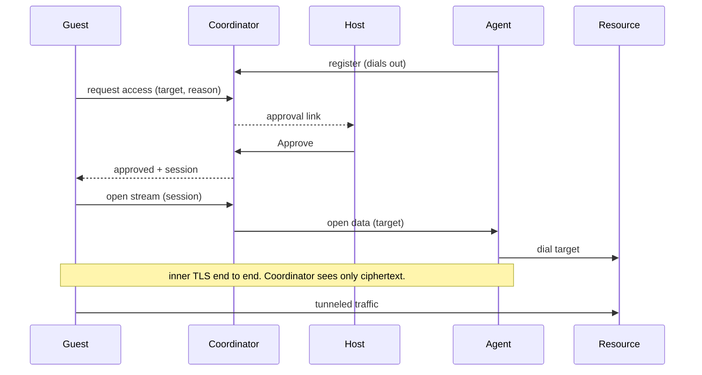

# Tessera

> Status: pre-1.0, no independent security review. Do not use it to guard
> production or sensitive systems without one. See [SECURITY.md](SECURITY.md).

Tessera is a consent-gated remote access broker. One person (the **guest**) asks
for temporary access to a system someone else (the **host**) owns. The host
approves with one tap on their own device. A scoped, audited, mutually-revocable
tunnel opens for as long as either side holds it.

The point is that the approving step stays trivial. The host sees who is asking,
what they want to reach, and why, then taps Approve. No VPN, no shared password,
no permanent account.

The name is the Roman *tessera hospitalis*, a token given to a guest as proof of
a trusted, welcomed relationship.

## Install

```bash
curl -fsSL https://raw.githubusercontent.com/emmayusufu/tessera/main/install.sh | bash
```

On first run, you'll be prompted to link to a coordinator (skip with `TESSERA_SKIP_LINK=1`).

Pulls the latest release binary for your OS and architecture. Falls back to `go install` if no release is published for your platform. Override the install location with `TESSERA_BINDIR`.

If you'd rather build manually:

```bash
git clone https://github.com/emmayusufu/tessera && cd tessera && make build
# binaries land in ./bin/{coordinator,agent,tessera}
```

## When you might use it

- **Pair programming across networks.** You want a teammate to hit your local
  dev server on `localhost:3000`. Send them a Tessera link, approve once, they
  reach it; Ctrl-C ends it.
- **Support sessions.** A customer can't reproduce a bug. You ask to reach their
  dev box for ten minutes; they approve from their phone.
- **Homelab access.** A friend wants to use your media server briefly. You
  approve from the kitchen.
- **Consulting into an internal system.** A remote contractor needs to look at
  an internal database; an on-site staff member approves; access closes when the
  session ends.

## How it works

Three small Go binaries. The agent dials *out* to the coordinator, so the
host's resource never accepts an inbound connection and nothing is exposed
until the host approves a specific request.



- **coordinator**: runs on a public host. Accepts mutual-TLS connections from
  agents and guests, serves the approval page, relays approved streams,
  writes the audit log. Opens no access on its own.
- **agent**: runs on the host's side as a background service. Dials out
  to the coordinator and waits. Accepts nothing inbound. On an approved stream
  it connects to the approved local `host:port` and pipes.
- **tessera**: the guest CLI. Requests access, waits for approval, then
  forwards a local port through the coordinator to the resource.

## The flow



## Access lifetime

Not permanent. A session lives only while it is held: either party ends it
instantly, it dies on disconnect, an idle stream times out after 30 minutes, and
every request, approval, session open and close is written to an append-only
audit log.

## Try it locally

```bash
make build
cd bin

# 1. generate a CA and certs (coordinator name = localhost for local testing)
./tessera ca --coordinator-name localhost

# 2. start the broker (mTLS on :8443, approval page on :8080)
./coordinator -listen :8443 -http :8080 -base-url http://localhost:8080 &

# 3. run an agent for share-id "demo", allowed to reach a local service
./agent -coordinator localhost:8443 -share-id demo -allow 127.0.0.1:5432 &

# 4. request access; the coordinator logs an approval URL, open it and tap Approve
./tessera connect -coordinator localhost:8443 -share-id demo \
  -target 127.0.0.1:5432 -reason "troubleshoot" -local 127.0.0.1:15432

# now 127.0.0.1:15432 forwards to the host's 127.0.0.1:5432 until you Ctrl-C
```

## Deploying

The coordinator needs to run on a host with a public address. Two ways: Docker
or a bare binary. Pick whichever feels lighter to maintain. The flags and env
vars are the same in both.

### Run with Docker

The image is a single 18 MB static binary on distroless. One image holds all
three binaries (coordinator, agent, tessera). Compose runs the coordinator by
default; the others are available via `--entrypoint` if you want to run them
in containers too.

```bash
# Build the image (one-time)
docker build -t tessera .

# Generate a CA and certs (one-time, no local Go toolchain needed)
mkdir -p certs && cd certs
docker run --rm -v "$PWD:/work" -w /work --entrypoint /usr/local/bin/tessera \
  tessera ca --coordinator-name tessera.example.org
cd ..

# Edit docker-compose.yml: set -base-url to your public URL,
# add HTTPS / operator-token lines as needed.

docker compose up -d
docker compose logs -f coordinator
```

The compose file mounts `./certs/` read-only and keeps the audit log in a named
volume. For HTTPS, mount your Let's Encrypt directory and add the `-http-cert`
/ `-http-key` flags to the command list.

### Run the bare binary

```bash
./coordinator -base-url https://tessera.example.org \
  -http-cert fullchain.pem -http-key privkey.pem
```

The coordinator logs the approval URL on every request. Route it to the host
(Slack, iMessage, email, whatever you already use) so they can tap Approve.

Require an operator token for operator actions (revoke). Generate one when you
deploy the coordinator, then save it once on the host:

```bash
tessera token <token-hex>
```

That writes it to `~/.config/tessera/operator-token`. After that, `tessera share`
auto-reads it, so you don't have to re-export it per shell. For ad-hoc curl:

```bash
curl -X POST -H "Authorization: Bearer $(cat ~/.config/tessera/operator-token)" \
  https://tessera.example.org/s/<sessionID>/revoke
```

When no token is configured on the coordinator, revoke is disabled.

### What's not covered

You still need a public host (a $5 VPS is fine), a DNS A record pointing at it,
open inbound ports 8443 and 8080 (or 443) on its firewall, and a TLS cert for
the approval page if you want HTTPS. Docker doesn't change any of that. It just
makes "run the coordinator process" boring.

## What's enforced

- A session is bound to the approved guest's certificate. A different
  enrolled guest cannot ride someone else's session, even with the ID.
- Revoke force-closes in-flight streams, it does not just block new ones.
- Traffic is end-to-end encrypted: guest and agent run an inner TLS session
  directly through the coordinator, which relays only ciphertext (a test asserts
  a plaintext marker never appears on the relay path).
- The agent only reaches targets on its `-allow` list, which is required.
- The approval link carries a secret token, separate from the request ID that
  appears in logs, so a leaked ID alone cannot approve. Operator actions (revoke)
  require an operator bearer token.

## How it compares

Tessera is tiny and single-purpose. Teleport's free Community Edition does far
more (SSH, Kubernetes, databases, RDP, web, SSO, session recording, RBAC) and is
production-grade and audited; if you can run it, use it. The one thing Tessera
gives you that Teleport gates behind its paid Enterprise tier is the request and
human-approve, just-in-time access flow. Tessera also runs with no cluster or
SSO to operate, and is MIT-licensed rather than AGPL. Verify Teleport's current
edition split before relying on that distinction.

## Status

v1: generic TCP forward to one approved `host:port` (covers a database, an
internal web portal, an RDP desktop), request, approve-by-web-link, mutual
revoke, audit log.

Not yet built: SSH-shell sharing, replayable session recording, RBAC, persistence.

## Security note

Tessera only makes sense as a consent-based tool: the host always approves,
access is scoped to a session, and everything is audited. It is not a backdoor.
The approval link is a bearer capability, so deliver it over a trusted channel
and serve the approval page over HTTPS (`-http-cert`/`-http-key`). For
production use guarding real systems, get the design security-reviewed first.

## Develop

```bash
make test    # go test ./...
make race    # go test -race ./...
make lint    # staticcheck + golangci-lint
make fmt     # gofmt + goimports
```

See [CONTRIBUTING.md](CONTRIBUTING.md) for the toolchain.

### Pre-commit hooks

```bash
brew install pre-commit          # or: pip install pre-commit
pre-commit install               # wires .git/hooks/pre-commit
```

After install, every `git commit` runs gofmt, go vet, go test, plus a few project-specific checks (no em-dashes in tracked files or commit messages, no AI/Claude attribution in commit messages, no work-email leakage).

To run all hooks manually without committing:

```bash
pre-commit run --all-files
```

## License

MIT
